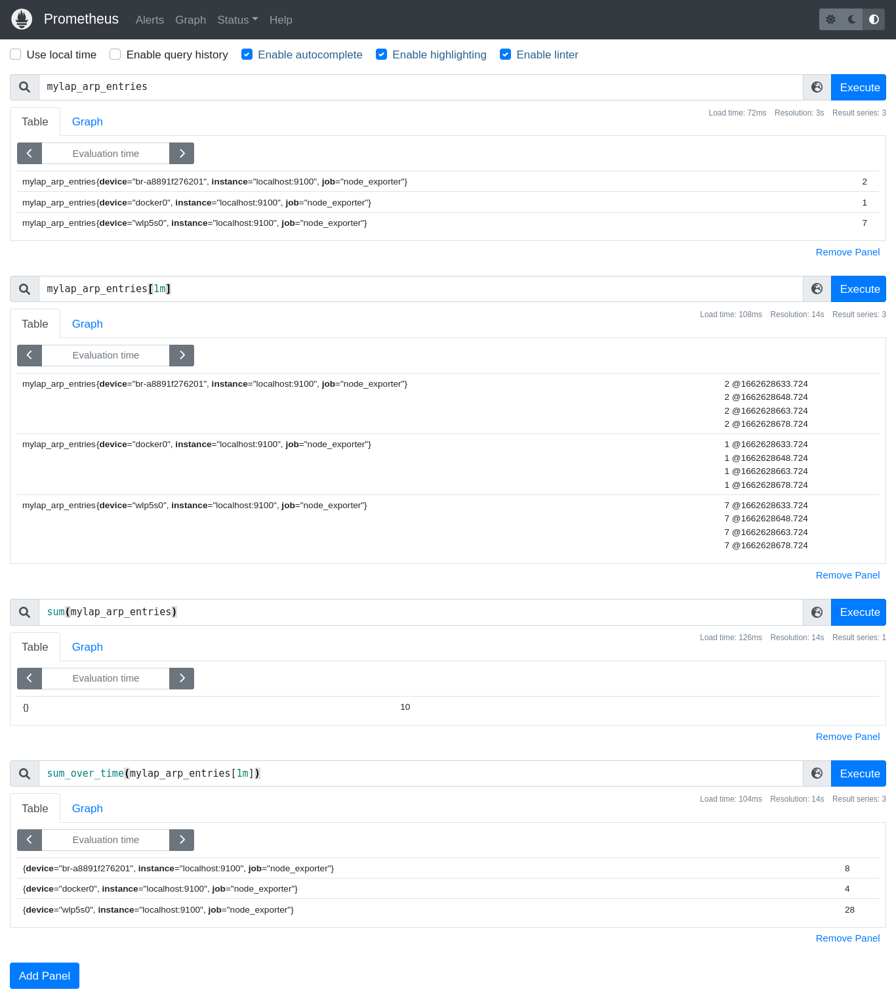
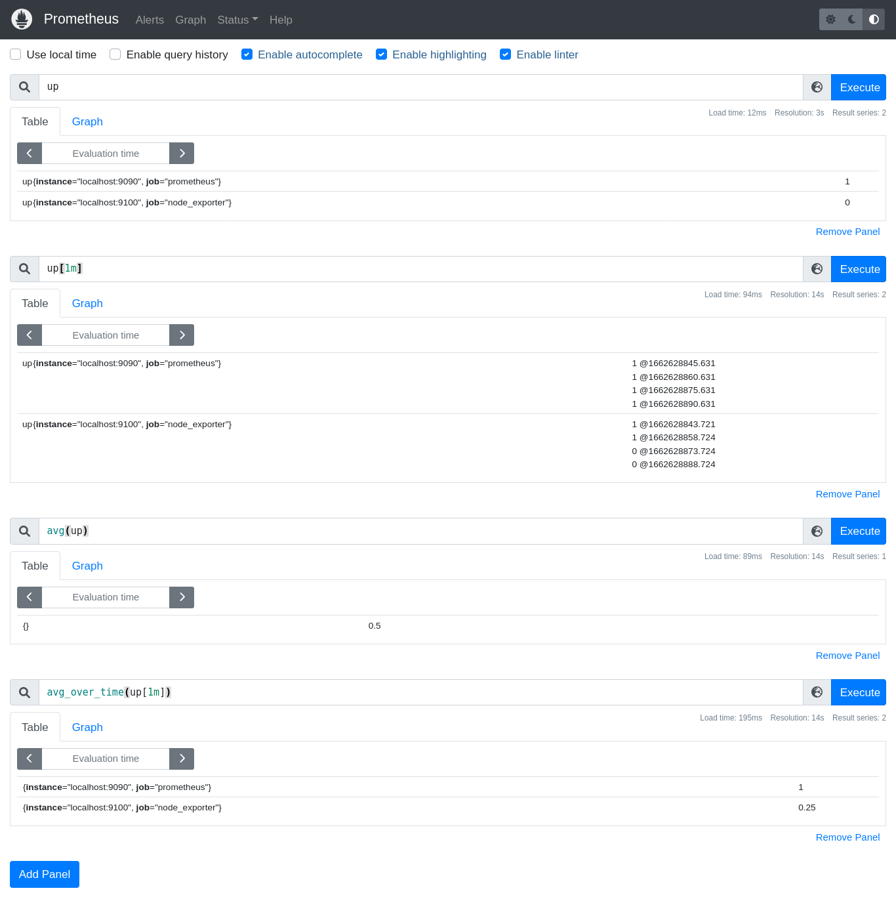

## Prometheus Learning

### Resources

- https://www.robustperception.io/blog/page/30/

- https://www.robustperception.io/get-alerted-before-your-ssl-certificates-expire/

### PromQL Functions

- **Count(<instant vector\>)**
    - Counts number of Time Series Results that the query gave.

- **Count_over_time(<range vetor\>)**
    - Counts the number of results each time series gave when query was ran.
     

    

- **sum(<instant vector\>)**
    - Adds all the values of the time series results

- **sum_over_time(<range vector\>)**
    - Adds all the values of each time series individually
     

    

- **avg(<instant vector\>)**
    - Takes average of the all the time series values in that instant

- **avg_over_time(<range vector\>)**
    - Takes average of the individual time series over a period of time.
     

    

